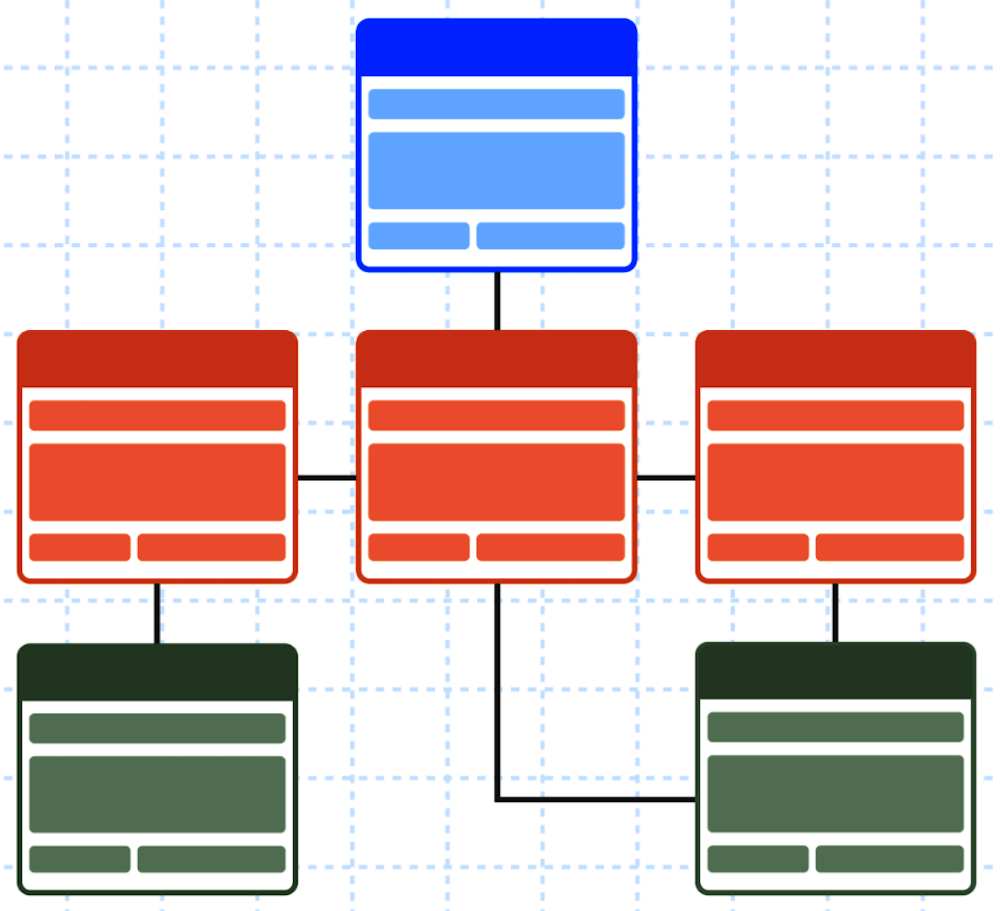

# Database Systems  CS305

## Assigned: 12 October 2023

## Due: END OF CLASS

When designing a database, it is necessary to have a good understanding of the data, and its underlying  relationships to be used to create logical tables that connect to other tables.

## Project Goals

* To gain experience using constraints to build database tables
* To encode integrity constraints on tables
* To gain experience connecting tables with the use of constraints
* To gain experience with writing queries to determine that both tables of the database are connected.

## Instructions

Please address the TODO's in the markdown text file, `src/code.md`. You are to submit this work to your GitHub repository at least three (3) times. Please enter all code from class as your deliverable. Your instructor will have more information about this activity.

## Project Assessment

This is a check mark grade. Your work will be considered complete when you see the green check-mark at the top of page of your GitHub repository.

## GatorGrade

You can check the baseline writing and commit requirements for this lab assignment by running department's assignment checking `gatorgrade` tool. To use `gatorgrade`, you first need to make sure you have Python3 installed (type `python --version` to check). If you do not have Python installed, please see:

- [Setting Up Python on Windows](https://realpython.com/lessons/python-windows-setup/)
- [Python 3 Installation and Setup Guide](https://realpython.com/installing-python/)
- [How to Install Python 3 and Set Up a Local Programming Environment on Windows 10](https://www.digitalocean.com/community/tutorials/how-to-install-python-3-and-set-up-a-local-programming-environment-on-windows-10)

Then, if you have not done so already, you need to install `gatorgrade`:

- First, [install `pipx`](https://pypa.github.io/pipx/installation/)
- Then, install `gatorgrade` with `pipx install gatorgrade`

Finally, you can run `gatorgrade`:

`gatorgrade --config config/gatorgrade.yml`

## Seeking Assistance

* Extra resources for using markdown include;
  + [Markdown Tidbits](https://www.youtube.com/watch?v=cdJEUAy5IyA)
  + [Markdown Cheatsheet](https://github.com/adam-p/markdown-here/wiki/Markdown-Cheatsheet)
* Do not forget to use git commands to push your work to the cloud for the instructor to grade your assignment. You can go to your GitHub repository using your browser to verify that your files have been submitted. Please see the TL’s or the instructor if you have any questions about assignment submission.

Students who have questions about this project outside of the lab time are invited
to ask them in the course's Discord channel or during instructor's or TL's office hours.
